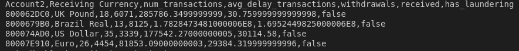

<h2 align="center">Agrégations sur les transactions enregistrées par une banque</h2>


<div align="center"></div>

<h2 align="center">François Legland</h2>

## À propos du projet

### Description

Une grande banque en ligne souhaite obtenir des informations et des statistiques sur les transactions qui sont survenus par l'intermédiaire des services proposés (virement, monnaie fiduciaire ou encore chèque). Pour cela, elle dispose d'un jeu de données qui contient un historique de près de 180 millions de transactions bancaires sous différentes devises, étalées sur plusieurs mois.

En tant que Data Engineer, ton objectif est de développer un script Spark qui soit capable de récupérer toutes les transactions contenues dans un seul fichier de données, afin de pouvoir faire des calculs d'agrégations dessus, et d'enregistrer les résultats dans une table de sortie spécifiée par les utilisateurs qui exécuteront le script.

Pour ses besoins en interne, il est attendu que le script Spark puisse accepter les trois paramètres suivants :
* `DESTINATION` est la destination où la table de sortie (au format CSV) sera enregistrée (exemples : s3://... pour AWS S3, gcs://... pour GCS, hdfs://...).
* `DATE_START` contient une date à partir de laquelle les calculs sur les transactions démarrent.
* `DATE_END` contient une date de fin à partir de laquelle les calculs sur les transactions s'arrêtent.


### Contraintes

Afin de pouvoir proposer un script Spark maintenable et ré-utilisable le plus efficacement possible, ce dernier doit respecter certaines contraintes.

#### Contraintes sur le programme d'extraction


* **Si le paramètre DESTINATION n'est pas renseigné**, alors le job Spark doit enregistrer la table de sortie sous HDFS, dans un répertoire par défaut.

* Le programme d'extraction doit être en mesure de pouvoir **filtrer selon une plage de dates** définies par les paramètres `DATE_START` et `DATE_STOP` au format ISO UTC (YYYY-mm-dd HH:MM:ss), et doit **vérifier que DATE_START < DATE_STOP**.

#### Contraintes sur la table de sortie

La table de sortie doit fournir une visibilité à la maille de chaque compte bancaire et devise.

* Chaque ligne de la table de sortie doit être établie à une maille compte bancaire et devise, et doit permettre d'obtenir l'ensemble des informations demandées sur ce compte. Par exemple, une transaction A vers B puis B vers A devront permettre de connaître la somme totale des fonds virés ou reçu du compte A.
  

* Les informations suivantes doivent être présentes pour chaque ligne (compte bancaire et devise) :
    *  Le nombre de transactions effectuées (**num_transactions**) depuis ce compte.
    *  Le délai moyen (en secondes arrondi à l'entier le plus proche) entre deux transactions successives (**avg_delay_transactions**).
    *  Le montant total émis (**withdrawals**) et reçus (**received**) uniquement pour les comptes ayant effectué au moins un virement.
        Une variable **has_laundering** qui indique si au moins une transaction effectuée par ce compte dans la devise comporte une suspicion de blanchiment d'argent.

## Étapes de réalisation

### 0. Clôner le dépôt git

```bash
git clone https://github.com/FrancLgd/PUBLIC-Data-Engineering-Datawarehouse-Hive-Banque.git
cd PUBLIC-Data-Engineering-Datawarehouse-Hive-Banque
```

### 1. Télécharger en local l'échantillon de données

```bash
# Pour l'échantillon des transactions
wget -P ./data https://blent-learning-user-ressources.s3.eu-west-3.amazonaws.com/projects/e5dfc2/transactions-small.zip
unzip ./data/transactions-small.zip -d ./data

# Pour l'échantillon des suspicions de fraude
wget -P ./data https://blent-learning-user-ressources.s3.eu-west-3.amazonaws.com/projects/e5dfc2/laundering-small.txt
```

### 2. Traitements sur l'échantillon

Dans un premier temps, sur notre machine locale, nous testons les traitements demandés sur un échantillon réduit de données. Ceux-ci sont documentés dans `./notebooks/sample_tester.ipynb`.

### 3. Stockage des données brutes sur HDFS

Nous disposons d'une instance Dataproc sur laquelle nous décidons de stocker le jeu de données brutes complet, en particulier sur son système de fichiers HDFS.

Pour ce faire, nous nous connectons premièrement à compte Google dédié via l'invite de commandes Google Cloud SDK.

```bash
# S'authentifier à GCP
gcloud auth revoke
gcloud auth login

# Définir le projet
gcloud config set project blent-sandbox-6169080881
```

Nous nous connectons ensuite au noeud maître de Dataproc pour y télécharger le jeu de données complet.

Après s'être connecté comme suit,

```bash
gcloud compute ssh main-cluster-m --zone=europe-west1-d
```

nous procédons au téléchargement puis à l'ajout du jeu de données dans HDFS:

```bash
# Pour les transactions
wget -P /tmp https://blent-learning-user-ressources.s3.eu-west-3.amazonaws.com/projects/e5dfc2/transactions-large.zip
unzip /tmp/transactions-large.zip -d /tmp
hdfs dfs -copyFromLocal /tmp/transactions-large.csv hdfs:///user/hdfs

# Pour les suspicions de fraude
wget -P /tmp https://blent-learning-user-ressources.s3.eu-west-3.amazonaws.com/projects/e5dfc2/laundering-large.txt
```

### 4. Soumettre le job sur un exemple

Via la commande suivante, nous soumettons un job Spark à notre cluster. Le paramètre `DESTINATION` est laissé par défaut.

```bash
gcloud dataproc jobs submit pyspark \
    --cluster main-cluster \
    --region europe-west1 \
    ./src/spark_etl.py \
    -- \
    --DATE_START "2022-09-01 15:00:00" \
    --DATE_END "2022-09-04 17:00:00"
```

Une fois l'exécution terminée, nous affichons un des fichiers csv par notre export sur le système HDFS cible.

```bash
hdfs dfs -cat hdfs:///user/hdfs/out_table_20220901_20220902.csv/part-00006-d73b4abe-76ae-418b-993d-be1a925289c4-c000.csv | head -n 5
```


